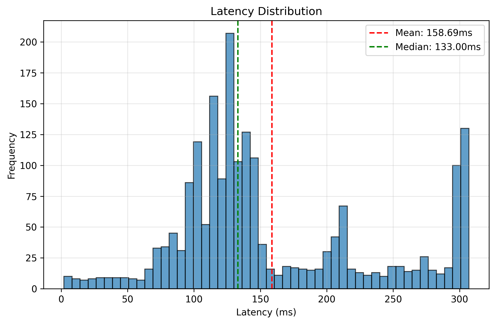
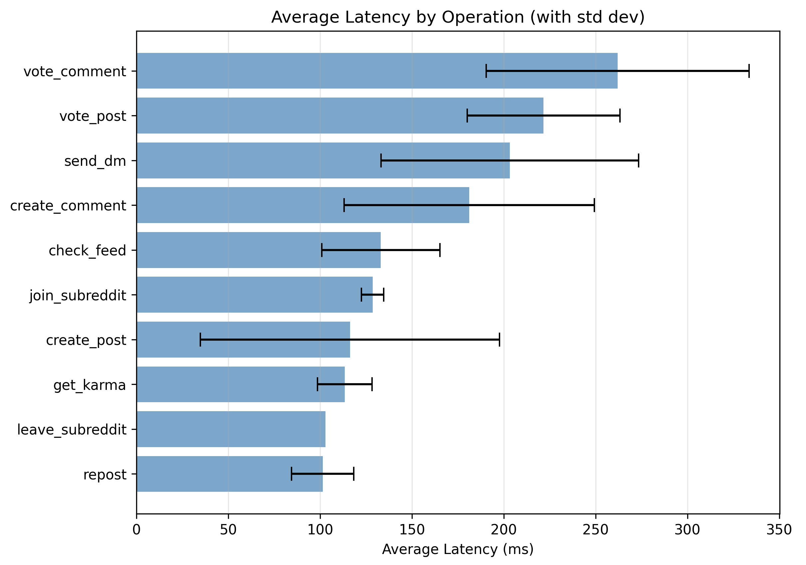

## Reddit Clone - Part I Report
**COP5615: Distributed Operating Systems Principles**  
**November 2, 2025**

---

### Team Members
- Shreyansh Nayak (1155-2257)
- Siddhant Chauhan (4973-4369)

---

### 1. Project Overview

This project implements a Reddit-style social media engine and simulator in **Gleam**, leveraging the **actor model** for concurrency and **SQLite** for data persistence. The system consists of two separate components:

1. **Engine**: A backend service providing core Reddit functionality (accounts, subreddits, posts, comments, voting, DMs, karma)
2. **Simulator**: A load generator that spawns concurrent client actors to stress-test the engine with realistic workloads

The implementation fulfills all Part I requirements, including separate client/engine processes, Zipf distribution for subreddit popularity, and comprehensive performance metrics collection.

---

### 2. System Architecture

#### 2.1 Component Design

**Engine (`engine/`)**
- **Storage Layer**: Modular repositories for each entity type (`accounts.gleam`, `posts.gleam`, `comments.gleam`, `votes.gleam`, etc.)
- **API Layer**: Public functional API (`engine_api.gleam`) exposing all operations
- **Server Layer**: Actor-based server (`engine_server.gleam`) that serializes database access through a single process

**Simulator (`simulator/`)**
- **Coordinator**: Orchestrates simulation phases (initialization → client spawning → execution → metrics aggregation)
- **Client Actors**: Independent processes simulating individual users, each executing 10 operations
- **Workload Generation**: Zipf distribution for subreddit popularity, behavior cycling through 11 operation types
- **Metrics Collection**: Per-client CSV files recording timestamps, latencies, and success rates

#### 2.2 Data Model

The SQLite schema has seven tables:
- `accounts`, `subreddits`, `memberships`, `posts`, `comments`, `votes`, `dms`
- Hierarchical comments via self-referential `parent_comment_id`
- Polymorphic votes using an `entity_type` + `entity_id` composite key
- Strategic indexes on foreign keys and frequently queried fields

---

### 3. Usage

Currently, the engine initializes the database; the web server will be implemented in Part II.

```bash
cd engine

# Build
gleam build

# Run the engine
gleam run -m main
```

The simulator uses the engine's public API to exercise different parameters and collect metrics for analysis.

```bash
cd simulator

# Build
gleam build

# Run simulation (2000 clients, 50 subreddits, 120s duration)
gleam run -m main 2000 50 120
```

These tasks can be automated by the root `Makefile`.

```bash
# Build both engine and simulator
make all

# Run
make run

# Clean
make clean
```

#### Configuration
Edit `simulator/src/config.gleam` to adjust:
- Client count
- Subreddit count
- Actions per client
- Zipf skew parameter

---

### 4. Performance Results

Our performance measurements were conducted using the following process:

- The simulator includes a built-in metrics collector that records per-operation timings and success flags from each client actor.
- Clients emit events (timestamp_ms, operation, success, latency_ms) which the collector writes to per-client CSVs.
- After a run, the collector aggregates those events into overall and per-operation statistics for each client.
- The data is then saved under the `simulator/metrics` folder for each client.

#### 4.1 Test Configuration

| Parameter | Value |
|-----------|-------|
| Simulated Users | 2000 concurrent actors |
| Subreddits | 50 |
| Total Operations | 20,000 |
| Simulation Duration | 120 seconds |
| Zipf Parameter | s = 1.1 |
| Hardware | Apple M2 (8-core), 8GB RAM, SSD |

#### 4.2 Aggregate Performance

Aggregated client metrics for the 2000-clients, 50-subreddits, 120s run show:

```
avg_latency_ms           :          158.69
median_latency_ms        :          133.00
min_latency_ms           :            2.00
max_latency_ms           :          307.00
std_latency_ms           :           74.45
p95_latency_ms           :          303.00
p99_latency_ms           :          305.01
```



#### 4.3 Per-Operation Latency



##### 4.3.1 Operation Distribution

```
check_feed       3490 (17.4%)  - Most frequent due to feed checking after each action
create_post      2950 (14.8%)  - Weighted by Zipf popularity multiplier
create_comment   2000 (10.0%)
vote_post        2000 (10.0%)
vote_comment     2000 (10.0%)
send_dm          2000 (10.0%)
get_karma        2000 (10.0%)
repost           2000 (10.0%)
join_subreddit   1550 (7.8%)
leave_subreddit    10 (0.1%)   - Rare due to behavior generation logic
```

---

### 5. Analysis & Insights

#### 5.1 Throughput Bottleneck

The system achieved **116 ops/sec** throughput, which is surprisingly high for a single-actor SQLite architecture. However, this is still limited by:

1. **Sequential database access**: The single engine actor processes one operation at a time
2. **SQLite write serialization**: Only one writer can access the database at a time
3. **Message queue buildup**: With 2000 concurrent clients, requests queue at the engine actor

#### 5.2 Latency Patterns

**Read operations** (get_karma, repost) show consistently low latencies (~98ms) due to simple SELECT queries on indexed fields.

**Vote operations** exhibit 2.5-3x higher latencies (~260-272ms) because each vote triggers a cascade:
1. Check existing vote for idempotency
2. Upsert vote record
3. Aggregate all votes to recalculate score
4. Update post/comment score
5. Retrieve author ID
6. Update author karma

This multi-step transaction is essential for data consistency but creates the highest latency operations in the system.

**Feed checks** vary widely (76-214ms) depending on the number of joined subreddits and posts in those communities.

---

### 6. Conclusion

This Part I implementation successfully demonstrates:
- All required Reddit functionality (accounts, subreddits, posts, comments, votes, DMs, karma)
- Separate engine and client processes with actor-based concurrency
- Realistic workload generation with Zipf distribution
- Comprehensive metrics collection and analysis
